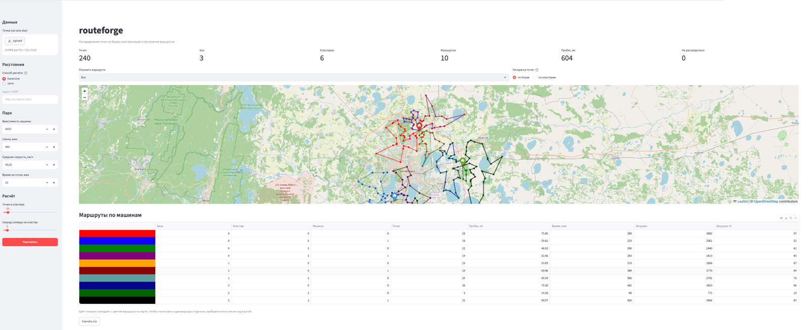
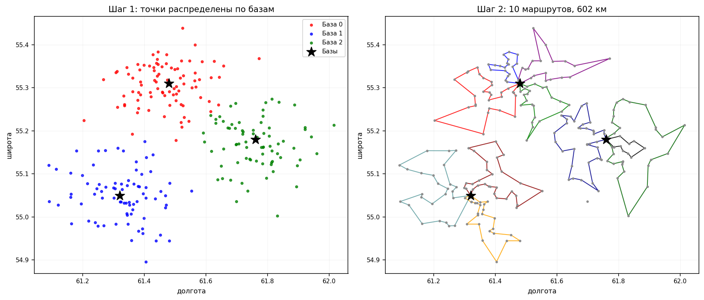
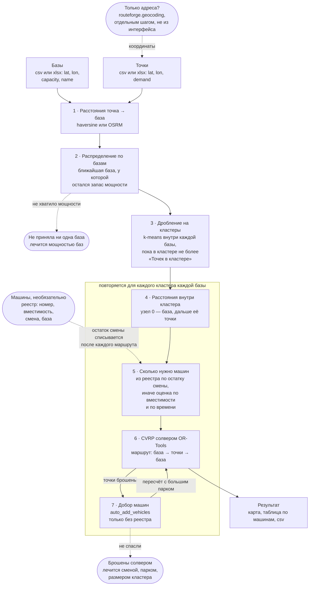

# routeforge

Планировщик объезда множества точек по схеме **cluster-first, route-second**.

Задача одна и та же независимо от предметной области: есть сотни или тысячи
точек, которые надо объехать, несколько баз и парк машин с ограниченной
вместимостью и длительностью смены. Требуется распределить точки по базам,
разбить их на выполнимые за смену группы и построить маршруты. Так решается
объезд контейнерных площадок, развозка по магазинам, обслуживание
оборудования на объектах.



*Демо-набор: 240 точек, 3 базы, 6 кластеров, 10 маршрутов. Цвет плашки в таблице
совпадает с цветом маршрута на карте; точки можно раскрасить по базам или по
кластерам. Запускается командой из раздела «Быстрый старт».*

## Почему в два шага

Решать CVRP на всём множестве точек сразу не выходит: время решения растёт
быстрее линейного, и одна задача на 5000 точек считается дольше, чем десять
по 500. Поэтому сначала точки распределяются по базам с учётом их мощности,
затем крупные группы дробятся до размера, посильного солверу, и CVRP решается
внутри каждой группы независимо.



*Слева — шаг первый: точки распределены по базам. Справа — шаг второй: внутри
каждой группы решён CVRP, получилось 10 маршрутов общей длиной 604 км.
Воспроизводится скриптом `scripts/make_demo_assets.py`; числа могут немного
отличаться — солвер недетерминирован.*

Расстояния можно считать двумя способами. По прямой (haversine) — мгновенно и
без инфраструктуры, годится для кластеризации, где важен порядок близости.
По дорогам через [OSRM](https://project-osrm.org/) — то, что реально проедет
машина; разница на городской сети доходит до полутора раз.

## Быстрый старт

```bash
git clone https://github.com/ValeriyPronkin/routeforge
cd routeforge
pip install -e ".[app,api,dev]"

python scripts/make_sample_data.py     # 240 точек, 3 базы, 6 машин
streamlit run app/streamlit_app.py     # интерактивный расчёт в браузере
```

Или из кода:

```python
import pandas as pd
from routeforge.io import read_points
from routeforge.config import Settings
from routeforge.pipeline import plan_routes_sync

sites = read_points("data/sample/sites.csv")
depots_df = pd.read_csv("data/sample/depots.csv")
depots = list(depots_df[["lat", "lon"]].itertuples(index=False, name=None))

result = plan_routes_sync(
    sites, depots,
    settings=Settings(distance_method="haversine", vehicle_capacity=4000),
    depot_capacities=list(depots_df["capacity"]),
)

print(result.routes_table())
print(f"{result.vehicles_used} машин, {result.total_distance_m / 1000:.0f} км")
```

Демо работает без Docker и без ключей: по умолчанию расстояния считаются по
прямой. Для дорожных расстояний см. [docs/osrm.md](docs/osrm.md) — OSRM на
маленьком регионе поднимается за пару минут.

## Термины

**База** — место, откуда машина выезжает и куда возвращается: склад,
распределительный центр, гараж, площадка выгрузки. В терминах задачи
маршрутизации это депо. Баз может быть несколько, у каждой своя мощность.

**Кластер** — группа точек внутри одной базы, которую получает солвер.
Точки базы дробятся на группы, потому что время решения растёт быстрее
линейного: одна задача на 3000 точек считается дольше, чем десять по 300.

**Машина** — один маршрут: выезд с базы, объезд точек, возврат. Без реестра
число машин выводится из вместимости и длительности смены. С реестром машина
становится конкретной: у неё номер, своя вместимость и свой остаток смены,
который убывает от маршрута к маршруту.

Порядок: точки распределяются по базам, точки каждой базы дробятся на
кластеры, внутри кластера строятся маршруты.

## Входные файлы

Файла два, и это две разные сущности. Чем они являются, зависит от задачи: в
одном случае базы — объекты обработки, а точки — источники образования; в
другом базы это склады, а точки — магазины. Приложение различает их только по
роли: из базы машина выезжает и в неё возвращается, точки она объезжает.

Готовит оба файла пользователь. Приложение не угадывает, какой из объектов
служит гаражом, и не выводит базы из списка точек: база — конкретное место с
собственными координатами и мощностью.

**Базы** — откуда машина выезжает и куда возвращается. Идут первыми, потому
что расчёт начинается с них: каждая точка сперва приписывается к базе, и уже
точки одной базы дробятся на кластеры.

| Колонка | Обязательна | Что значит |
|---|---|---|
| `lat`, `lon` | да | координаты |
| `capacity` | нет | мощность: сколько база принимает или отгружает за период, в единицах спроса. Пустая клетка — не ограничена |
| `name` | нет | подпись на карте и в таблице; нет — берётся `id` |
| `id` | нет | код базы |

**Точки** — то, что объезжаем:

| Колонка | Обязательна | Что значит |
|---|---|---|
| `lat`, `lon` | да | координаты; `55,7558` разбирается наравне с `55.7558` |
| `demand` | нет | спрос: вес, объём, штуки — в тех же единицах, что вместимость машины. Колонки нет — спрос нулевой |
| `id` | нет | код объекта для карты и таблицы; нет — нумеруются по порядку |

**Машины** — реестр парка, необязательный. Без него парк считается
однородным, а число машин подбирает расчёт; с ним парк становится
ограничением задачи: машин ровно столько, сколько строк в файле.

| Колонка | Обязательна | Что значит |
|---|---|---|
| `capacity` | да | вместимость именно этой машины, в единицах спроса |
| `id` | нет | госномер или инвентарный номер — им машина названа в таблице маршрутов. Нет колонки — будет `ТС 0`, `ТС 1` |
| `max_time_min` | нет | смена этой машины; пусто — берётся общая из настроек |
| `depot` | нет | индекс базы, к которой машина приписана; пусто — доступна любой |

Одна строка — одна машина. Вместимость считается при подготовке файла: если
в реестре объём кузова, переводите его в те же единицы, что и спрос точек
(в прежнем расчёте это был объём × плотность × коэффициент уплотнения).

Заголовки распознаются русские и английские, регистр не важен: `Широта`,
`lat`, `latitude` — одно и то же. csv читается и с запятой, и с точкой с
запятой, как его сохраняет Excel в русской локали. Свои названия колонок
добавляются кодом, см. `COLUMN_ALIASES` и `DEPOT_COLUMN_ALIASES` в
`routeforge/io.py`.

Строгость к ошибкам разная и намеренно. Точка с непригодными координатами
отбрасывается: потерять одну из тысячи — полбеды. Такая же база — ошибка
чтения: посчитать задачу не из того места хуже, чем не посчитать вовсе.

Образцы всех трёх — `data/sample/depots.csv`, `data/sample/sites.csv` и
`data/sample/vehicles.csv`.

## Как проходят данные

Схема показывает весь путь от файла до маршрутов и то, на каком шаге
теряются точки. Потерь два вида, и лечатся они разным — см.
[docs/algorithm.md](docs/algorithm.md).



Шаг 2 отвечает на вопрос «чья это точка», шаг 3 — «каким куском отдать точки
солверу», шаги 5–7 — «сколько машин и в каком порядке они объедут кластер».
Кластер существует только ради скорости расчёта: машина его границ не знает,
она видит базу и свой список точек.

## Как машины расходятся по кластерам

Это касается только расчёта с реестром. Без файла машин парк однородный и
оценивается на каждый кластер заново.

У каждой машины два ресурса: вместимость и остаток смены. На очередной
кластер машины набираются по убыванию остатка — свежая успеет больше, — и
набор прекращается, как только их суммарной вместимости хватает на спрос
кластера. Весь парк на один кластер не уходит: остальным тоже ехать.

После расчёта из остатка каждой машины вычитается фактическое время её
маршрута. Машина с остатком меньше `vehicle_min_remaining_min` (по умолчанию
40 минут) на линию больше не выводится: за оставшиеся минуты она не успеет
даже доехать, и остаток обнуляется.

Отсюда несколько следствий, которые стоит знать заранее:

* **Машина работает столько, сколько у неё есть.** Одна и та же машина может
  взять два-три кластера подряд, пока хватает смены, и не может выйти в двух
  кластерах одновременно — ресурс общий и списывается.
* **Кластеры считаются по убыванию спроса.** Парк конечен, и крупные группы
  должны получить машины первыми, иначе результат зависит от случайного
  порядка обхода.
* **Кончились машины — точки уходят в потери.** Не в ошибку и не в тишину:
  они попадают в `dropped` и видны в метрике «Не обслужено».
* **Реестр отменяет подбор.** Добор машин (`auto_add_vehicles`) работает
  только для оценки; если парк задан файлом, он и есть ограничение задачи.
* **Номер машины идёт до конца.** В таблице маршрутов колонка «Машина» —
  это госномер из реестра, а не порядковый индекс внутри кластера.

## Отчёт

Расчёт отвечает на два разных вопроса, и в отчёте они разными листами.

**Маршруты** — куда ехать: база, кластер, машина, число точек, пробег, время
и загрузка каждого рейса. Машина здесь названа номером из реестра, если он
задан, иначе порядковым индексом внутри кластера.

**Сводка по машинам** — чем занят парк. Строка на каждую машину реестра,
включая те, что никуда не поехали: простой это такой же результат расчёта,
как загруженный день, и видеть его нужно.

| Колонка | Что значит |
|---|---|
| `routes` | сколько рейсов сделала машина за день |
| `stops` | сколько точек обслужила |
| `distance_km` | суммарный пробег |
| `load` | сколько вывезла, в единицах спроса |
| `duration_min` | сколько отработала |
| `shift_used_pct` | какую долю смены это заняло |
| `remaining_min` | сколько смены осталось; ноль — машина отработала или остаток ниже порога |

Из интерфейса отчёт скачивается двумя кнопками: xlsx с обоими листами и csv
с одними маршрутами. Из кода — `PlanResult.routes_table()`,
`PlanResult.vehicles_table()` и `routeforge.io.write_report`, которому можно
дать как путь, так и открытый файловый объект.

Сводка строится только при расчёте с реестром: без него у машин нет номеров,
и сворачивать не по чему.

## Настройки

Файл `config.yaml` рядом с проектом, необязательный — без него берутся
значения по умолчанию. Любое поле переопределяется переменной окружения с
префиксом `ROUTEFORGE_`:

```yaml
common:
    app_title: 'Логистика'          # как приложение называет себя на экране
    distance_method: 'haversine'    # haversine или osrm
    osrm_url: 'http://localhost:5000'
    log_dir: 'logs'
    log_level: 'INFO'
```

```bash
ROUTEFORGE_APP_TITLE='План на завтра' streamlit run app/streamlit_app.py
```

## Логи

Журнал пишется в `logs/routeforge.log` — путь задаётся `log_dir`, ротация по
10 МБ, хранится пять файлов. Путь показан в панели слева, чтобы его не
приходилось искать.

При запуске из терминала те же строки идут в консоль. Если запускали в
фоне, смотрите файл:

```bash
tail -f logs/routeforge.log
```

## Из чего состоит

| Модуль | Отвечает за |
|---|---|
| `routeforge.io` | чтение csv/xlsx, распознавание русских и английских заголовков, проверка координат |
| `routeforge.geocoding` | адрес → координаты через Nominatim или Яндекс, если координат нет |
| `routeforge.distance` | матрицы расстояний: haversine векторно, OSRM через `/table` асинхронно |
| `routeforge.clustering` | распределение по базам с учётом мощности, дробление крупных групп |
| `routeforge.solver` | CVRP на OR-Tools: вместимость, длительность смены, штраф за пропуск, раздельные точки старта и финиша |
| `routeforge.polylines` | геометрия маршрутов — прямые отрезки или реальные дороги |
| `routeforge.viz` | карты folium |
| `routeforge.pipeline` | всё перечисленное одним вызовом |

Входной формат нарочно простой — таблица с колонками `lat`, `lon`, `demand`.
Заголовки распознаются и русские (`Широта`, `Долгота`, `Спрос`, `Вес`), и
английские; координаты вида `55,7558` с запятой разбираются, строки с
битыми координатами отбрасываются с указанием, сколько и каких. Свои
заголовки добавляются одной строкой — см. `COLUMN_ALIASES` в
`routeforge/io.py`.

Одну ловушку стоит держать в голове: маршрутизация без спроса — допустимый
сценарий, поэтому нераспознанная колонка спроса не ошибка, а ноль. Если
колонка в файле есть, но названа непривычно, все точки получат нулевой спрос
и солвер построит один маршрут на всё. Сверьтесь с `COLUMN_ALIASES`.

## Данные

Демо-набор синтетический, генерируется скриптом. Настоящие выгрузки, на
которых инструмент работает, содержат адресную привязку объектов и в открытый
доступ не выкладываются.

## Документация

* [docs/algorithm.md](docs/algorithm.md) — что происходит на каждом шаге и какие параметры на что влияют
* [docs/osrm.md](docs/osrm.md) — как поднять OSRM локально
* [notebooks/](notebooks/) — кластеризация, сравнение способов расчёта расстояний, решение CVRP

## Разработка

```bash
pip install -e ".[app,api,dev]"
pytest
```

## Лицензия

MIT, см. [LICENSE](LICENSE).

---

## English

**routeforge** is a cluster-first, route-second planner for capacitated vehicle
routing. Given many service points, several depots and a fleet with capacity
and shift-length limits, it assigns points to depots, splits large groups into
solver-sized chunks and solves a CVRP within each.

Distances come either from the haversine formula (instant, no infrastructure)
or from a local OSRM instance (real road network). Routing is done with
Google OR-Tools; maps are rendered with folium.

See [Quick start](#быстрый-старт) above; the demo runs without Docker or API keys.
